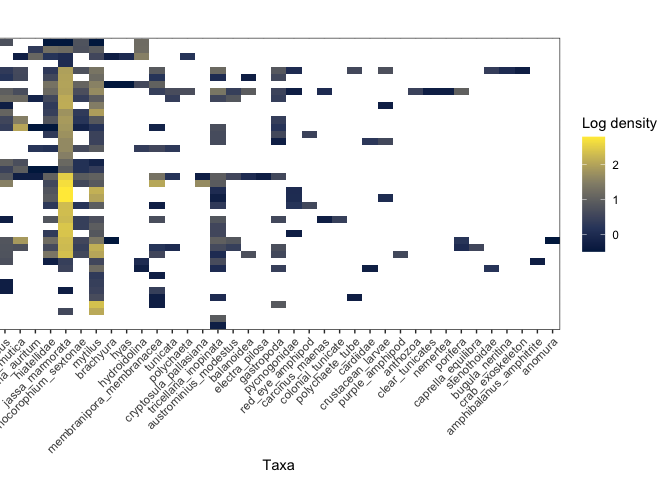

1-DataAnalysis
================
Arlie McCarthy
02/05/2021

# Code Setup and Data Import - because that is super-important

I have one data file with the count data from lab processing. The file
needs some wrangling to calculate a density (counts per cm2) for each
quadrat sampled.

``` r
taxon_count_data <- read_csv(here::here("data", "taxon_count_data_internal_pipework.csv"))
```

    ## 
    ## ── Column specification ────────────────────────────────────────────────────────
    ## cols(
    ##   sample_id = col_character(),
    ##   taxon = col_character(),
    ##   taxon_grouping_qualifier = col_character(),
    ##   description = col_character(),
    ##   sub_sample = col_character(),
    ##   count = col_double(),
    ##   multiply_by = col_double(),
    ##   divide_by = col_double(),
    ##   quadrat_grids_number = col_double(),
    ##   quadrad_mesh_size_cm2 = col_double(),
    ##   area_sampled = col_double(),
    ##   density = col_logical(),
    ##   sub_sample_type = col_character(),
    ##   sub_sample_number = col_double(),
    ##   sample_number = col_double(),
    ##   area = col_double(),
    ##   stage = col_double(),
    ##   quadrat_number = col_double()
    ## )

``` r
taxon_density <- taxon_count_data %>% 
  clean_names() %>% 
  mutate(id = paste(area, quadrat_number, sep = "_")) %>% #some quadrats had multiple 'sample' so changed to just area and quadrat
  mutate(taxon_verified = case_when(taxon == "mussel" ~ "mytilus", 
                                    taxon == "acorn barnacle" ~ "amphibalanus_improvisus",
                                    taxon == "barnacle type 2" ~ "amphibalanus_amphitrite",
                                    taxon == "clam" ~ "hiatellidae",
                                    taxon == "c.f. Jassa" ~ "jassa_marmorata", 
                                    taxon == "acorn barnacle ribbed" ~ "austrominius_modestus",
                                    taxon == "crab" ~ "carcinus_maenas",
                                    taxon == "encrusting bryozoan" ~ "membranipora_membranacea",
                                    taxon == "white tufted bryozoan" | taxon == "type 2 white tufted bryozoan" ~ "tricellaria_inopinata",
                                    taxon == "round amphipod" | taxon == "green eye amphipod" ~ "stenothoidae",
                                    taxon == "c.f. Conchoderma" ~ "conchoderma_auritum", 
                                    taxon == "brown bryozoan" ~ "bugula_neritina",
                                    taxon == "c.f. Corophium" ~ "monocorophium_sextonae",
                                    taxon == "caprellid" ~ "caprella_mutica",
                                    taxon == "c.f. Schizoporella" ~ "cryptosula_pallasiana",
                                    taxon == "spiked encrusting bryo" ~ "electra_pilosa",
                                    taxon == "mystery tunicates? large anemone?" ~ "clear_tunicates",
                                    taxon == "c.f. Caprella equilibra" ~ "caprella_equilibra",
                                    taxon == "anemone" ~ "anthozoa",
                                    taxon == "crab juvenile" ~ "brachyura",
                                    taxon == "Hyas sp" ~ "hyas",
                                    taxon == "hydroid" ~ "hydroidolina",
                                    taxon == "tunicate" ~ "tunicata",
                                    taxon == "polychaete" ~ "polychaeta",
                                    taxon == "gastropod" ~ "gastropoda",
                                    taxon == "juvenile barnacle" ~ "balanoidea",
                                    taxon == "mystery thing" ~ "tunicata",
                                    taxon == "pycnogonid" ~ "pycnogonidae",
                                    #taxon == "red-eye amphipod" ~ "amphipoda",
                                    taxon == "other bivalve" ~ "cardiidae",
                                    taxon == "sponge" ~ "porifera",
                                    taxon == "squat lobster juvenile" ~ "anomura",
                                    TRUE ~ taxon
                                    )) %>% 
  group_by(id, taxon_verified, taxon_grouping_qualifier, area, stage, quadrat_number) %>% 
  mutate(density = count*multiply_by/divide_by/area_sampled*100) %>% #counts per m2
  summarise(avg_density = mean(density))
```

    ## `summarise()` has grouped output by 'id', 'taxon_verified', 'taxon_grouping_qualifier', 'area', 'stage'. You can override using the `.groups` argument.

``` r
site_info <- taxon_density %>% 
  ungroup() %>% 
  select(id, area, stage, quadrat_number) %>% 
  group_by(id) %>% 
  slice(1)
```

# Preparing Data for ordination

I take my data from counts to a community matrix, with species as
variables and rows as samples

``` r
community_matrix_rough <- taxon_density %>% 
  mutate(full_taxon_group = paste(taxon_verified, taxon_grouping_qualifier, sep = "_")) %>% 
  filter(full_taxon_group != "mytilus sp_valves intact, no tissue",
         full_taxon_group != "NA_NA",
         full_taxon_group != "mussel sp_valves intact",
         full_taxon_group != "insect_NA",
         full_taxon_group != "crab_exoskeleton_NA",
         full_taxon_group != "polychaete tube") %>% 
  group_by(id, taxon_verified) %>% 
  summarise(avg_density = sum(avg_density)) %>% 
  pivot_wider(names_from = taxon_verified, values_from = avg_density, values_fill = 0) %>% 
  ungroup()
```

    ## `summarise()` has grouped output by 'id'. You can override using the `.groups` argument.

``` r
#community_matrix_rough[is.na(community_matrix_rough)] <- 0
community_matrix <- community_matrix_rough %>% 
  clean_names() %>% 
  column_to_rownames(var = "id") %>% 
  filter_all(any_vars(. != 0))
```

## nMDS

``` r
internal_pipe_nmds <- metaMDS(community_matrix, distance = "bray", k = 2, trymax = 500)
```

    ## Square root transformation
    ## Wisconsin double standardization
    ## Run 0 stress 0.2008899 
    ## Run 1 stress 0.1958568 
    ## ... New best solution
    ## ... Procrustes: rmse 0.1219134  max resid 0.2882575 
    ## Run 2 stress 0.2024996 
    ## Run 3 stress 0.1920054 
    ## ... New best solution
    ## ... Procrustes: rmse 0.1100512  max resid 0.2727294 
    ## Run 4 stress 0.2170999 
    ## Run 5 stress 0.2059202 
    ## Run 6 stress 0.1920056 
    ## ... Procrustes: rmse 7.111693e-05  max resid 0.0002833201 
    ## ... Similar to previous best
    ## Run 7 stress 0.2155964 
    ## Run 8 stress 0.2025342 
    ## Run 9 stress 0.2058718 
    ## Run 10 stress 0.1963071 
    ## Run 11 stress 0.196372 
    ## Run 12 stress 0.1918381 
    ## ... New best solution
    ## ... Procrustes: rmse 0.009508088  max resid 0.04409867 
    ## Run 13 stress 0.2129508 
    ## Run 14 stress 0.2065549 
    ## Run 15 stress 0.216557 
    ## Run 16 stress 0.2010042 
    ## Run 17 stress 0.1963832 
    ## Run 18 stress 0.196372 
    ## Run 19 stress 0.1963719 
    ## Run 20 stress 0.20701 
    ## Run 21 stress 0.1958571 
    ## Run 22 stress 0.1963719 
    ## Run 23 stress 0.1919469 
    ## ... Procrustes: rmse 0.004617774  max resid 0.0158914 
    ## Run 24 stress 0.1918383 
    ## ... Procrustes: rmse 0.0001104586  max resid 0.0004566954 
    ## ... Similar to previous best
    ## *** Solution reached

``` r
internal_pipe_nmds
```

    ## 
    ## Call:
    ## metaMDS(comm = community_matrix, distance = "bray", k = 2, trymax = 500) 
    ## 
    ## global Multidimensional Scaling using monoMDS
    ## 
    ## Data:     wisconsin(sqrt(community_matrix)) 
    ## Distance: bray 
    ## 
    ## Dimensions: 2 
    ## Stress:     0.1918381 
    ## Stress type 1, weak ties
    ## Two convergent solutions found after 24 tries
    ## Scaling: centring, PC rotation, halfchange scaling 
    ## Species: expanded scores based on 'wisconsin(sqrt(community_matrix))'

``` r
data_scores <- as.data.frame(scores(internal_pipe_nmds))  #Using the scores function from vegan to extract the site scores and convert to a data.frame
data_scores$site <- rownames(internal_pipe_nmds)  # create a column of site names, from the rownames of data.scores
data_scores <- data_scores %>% 
  rownames_to_column(var = "id") %>% 
  left_join(site_info)
```

    ## Joining, by = "id"

``` r
data_scores$n_species <- specnumber(community_matrix, MARGIN = 1)
data_scores$shannon <- diversity(community_matrix, index = "shannon")
data_scores$simpson <- diversity(community_matrix, index = "simpson")
species_scores <- as.data.frame(scores(internal_pipe_nmds, "species"))  #Using the scores function from vegan to extract the species scores and convert to a data.frame
species_scores$species <- rownames(species_scores)
```

Plotting with ggplot

``` r
nmds_plot <- ggplot() + 
  #geom_text(data=species_scores,aes(x=NMDS1,y=NMDS2,label=species),alpha=0.5) +  # add the species labels
  #geom_point(data=data_scores,aes(x=NMDS1,y=NMDS2,shape=as_factor(stage), colour= as_factor(area)),size=3) + # add the point markers
  geom_point(data=data_scores,aes(x=NMDS1,y=NMDS2,shape = as_factor(stage), colour = n_species),size=3) + # add the point markers
  #geom_text(data=data_scores,aes(x=NMDS1,y=NMDS2,label=area),size=6,vjust=0) +  # add the site labels
  coord_equal() +
  theme_bw() +
  scale_colour_viridis_c("Number of species") +
  scale_shape("Stage of Pipework", labels = c("1 - sea chest", "2 - sea strainer", "3 - mid ships", "4 - overboard discharge"))
nmds_plot
```

<!-- -->

``` r
save_plot(here("outputs", "nmds_plot.png"), nmds_plot, base_width = 183, base_height = 100, units = "mm")
```

Checking the nMDS

``` r
goodness(internal_pipe_nmds) # Produces a results of test statistics for goodness of fit for each point
```

    ##  [1] 0.02033509 0.02824201 0.03442590 0.02497329 0.04245239 0.02981380
    ##  [7] 0.02768384 0.01849126 0.02718732 0.03431184 0.03431184 0.02573425
    ## [13] 0.02271676 0.03631014 0.01769830 0.02782913 0.03475630 0.02896647
    ## [19] 0.05436328 0.03690273 0.05350072 0.02773024 0.02516778 0.01609032
    ## [25] 0.02060017 0.03154791 0.01988641 0.01807713 0.03431184 0.02672314
    ## [31] 0.04501758 0.02690322 0.04509841 0.02000358 0.01778452 0.01890682
    ## [37] 0.02672433 0.02341403 0.01898516 0.01927002 0.02304065

``` r
stressplot(internal_pipe_nmds) # Produces a Shepards diagram
```

<!-- -->

# Density of different groups

Here I will make a stacked bar chart to show mean density of different
taxonomic groups at each stage of the pipework

``` r
mean_density_stage <- taxon_density %>% 
  mutate(full_taxon_group = paste(taxon_verified, taxon_grouping_qualifier, sep = "_")) %>% 
  filter(full_taxon_group != "mytilus sp_valves intact, no tissue",
         full_taxon_group != "NA_NA",
         full_taxon_group != "mussel sp_valves intact",
         full_taxon_group != "insect_NA",
         full_taxon_group != "crab exoskeleton_NA",
         full_taxon_group != "polychaete tube_NA",
         full_taxon_group != "polychaete tube_fragment") %>% 
  group_by(id, taxon_verified, area, stage) %>% 
  summarise(avg_density = sum(avg_density)) %>% #this ensures that there is only one number per taxa per sample
  ungroup() %>% 
  filter(!is.na(avg_density)) %>% 
  group_by(taxon_verified, stage) %>% 
  summarise(avg_density = mean(avg_density))
```

    ## `summarise()` has grouped output by 'id', 'taxon_verified', 'area'. You can override using the `.groups` argument.

    ## `summarise()` has grouped output by 'taxon_verified'. You can override using the `.groups` argument.

Check the species names and allocate higher taxonomic groups

``` r
taxa_list <- unique(taxon_density$taxon_verified) %>% 
  as_tibble() %>% 
  rename(taxon_name = value)
aphia_id <- wm_name2id_(name = taxa_list$taxon_name)
```

    ## Warning: (204) No Content - NA

    ## Warning: `data_frame()` was deprecated in tibble 1.1.0.
    ## Please use `tibble()` instead.

    ## Warning: (204) No Content - red-eye amphipod

    ## Warning: (204) No Content - colonial tunicate

    ## Warning: (204) No Content - polychaete tube

    ## Warning: (204) No Content - crustacean larvae

    ## Warning: (204) No Content - insect

    ## Warning: (204) No Content - purple amphipod

    ## Warning: (204) No Content - clear_tunicates

    ## Warning: (204) No Content - crab exoskeleton

``` r
aphia_id_df <- aphia_id %>% 
  as.data.frame() %>% 
  pivot_longer(cols = everything(),
               names_to = "taxon_name",
               values_to = "id") 
classification <- wm_classification_(aphia_id) %>% 
  pivot_wider(id_cols = id, names_from = c(rank), values_from = c(scientificname), values_fill = NA) %>%
  mutate(id = as.integer(id))
taxa_list_full <- aphia_id_df %>% 
  left_join(classification, by = "id") %>% 
  right_join(taxa_list, by = "taxon_name")
mean_density_stage_plotting <- mean_density_stage %>% 
  rename(taxon_name = taxon_verified) %>% 
  left_join(taxa_list_full) %>% 
  mutate(plotting_name = case_when(!is.na(Species) ~ Species,
                                   is.na(Species) ~ Family,
                                   is.na(Family) ~ Order,
                                   is.na(Order) ~ Class,
                                   is.na(Class) ~ Subphylum,
                                   is.na(Subphylum) ~ Phylum)) %>% 
  mutate(plotting_name = case_when(is.na(plotting_name) ~ Order,
                                   TRUE ~ plotting_name)) %>%
  mutate(plotting_name = case_when(is.na(plotting_name) ~ Class,
                                   TRUE ~ plotting_name)) %>%
  mutate(plotting_name = case_when(is.na(plotting_name) ~ Subphylum,
                                   TRUE ~ plotting_name)) %>%
  mutate(plotting_name = case_when(is.na(plotting_name) ~ Phylum,
                                   TRUE ~ plotting_name)) %>% 
  mutate(plotting_name = case_when(taxon_name == "red-eye amphipod" ~ "Amphipoda",
                                   taxon_name == "purple amphipod" ~ "Amphipoda",
                                   taxon_name == "clear_tunicates" ~ "Tunicata",
                                   taxon_name == "colonial tunicate" ~ "Tunicata",
                                   taxon_name == "crustacean larvae" ~ "Crustacea",
                                   TRUE ~ plotting_name)) %>%
  mutate(Phylum = case_when(taxon_name == "red-eye amphipod" ~ "Arthropoda",
                                   taxon_name == "purple amphipod" ~ "Arthropoda",
                                   taxon_name == "clear_tunicates" ~ "Chordata",
                                   taxon_name == "colonial tunicate" ~ "Chordata",
                                   taxon_name == "crustacean larvae" ~ "Arthropoda",
                            TRUE ~ Phylum)) %>% 
  select(taxon_name, stage, avg_density, plotting_name, Phylum) %>% 
  group_by(plotting_name, Phylum, stage) %>% 
  summarise(avg_density = sum(avg_density)) %>% #this ensures that there is only one number per taxa per sample
  ungroup() %>% 
  arrange(Phylum)
```

    ## Joining, by = "taxon_name"

    ## `summarise()` has grouped output by 'plotting_name', 'Phylum'. You can override using the `.groups` argument.

Now to plot it. This plot will be aligned with a schematic diagram
representing the pipework system, so that readers can visualise passage
through the pipes and the changes in taxa over space. Ultimately, this
will have to be grouped/coloured by more manageable chunks than all the
taxa I have listed. But even without that, it’s clear that the Jassa
amphipods dominate right the way through. It’s also clear that there
isn’t a great deal surviving in the pipework areas sampled in the middle
of the ship, but they do survive transit and settle and grow in the
final stage before overboard discharge.

``` r
pal <- c("#332288", "#117733", "#44AA99", "#88CCEE", "#DDCC77", "#CC6677", "#AA4499", "#882255")
stacked_bar_plot <- ggplot() +
  geom_bar(data = mean_density_stage_plotting,
           aes(x = stage, y = avg_density, fill = Phylum),
           colour = "white",
           stat = "identity",
           position = "stack") +
#  geom_line(data = mean_density_stage, #problem with line is that without 0 for stages where taxa are absent, it connects the line making it look like the density goes consistently up/down rather than sharp changes
#           aes(x = stage, y = avg_density, colour = taxon),
#           stat = "identity",
#           position = "stack") +
  labs(x = "Stage of Pipework") +
  ylab(expression(Mean~density~(individuals~per~m^2))) +
  theme_bw() +
  scale_fill_manual("Phylum", values = pal)
  #scale_fill_viridis_d(option = "B", direction = 1, begin = 0.1)
stacked_bar_plot
```

<!-- -->

``` r
save_plot(here("outputs", "stacked_bar_plot.png"), stacked_bar_plot, base_width = 183, base_height = 100, units = "mm")
```

# Creating a heatmap with dendrograms

``` r
species_names <- colnames(community_matrix)
# Obtain the dendrogram
dend <- as.dendrogram(hclust(vegdist(community_matrix, method = "bray")))
dend_data <- dendro_data(dend)
```

#### Setup the data, so that the layout is inverted (this is more “clear” than simply using coord\_flip())

``` r
segment_data <- with(
  segment(dend_data), 
  data.frame(x = y, y = x, xend = yend, yend = xend))
# Extract dendrogram terminal segment data
dendrogram_ends <- with(segment(dend_data) %>%
  filter(yend == 0),
  data.frame(x = y, y = x, xend = yend, yend = xend))
```

Use the dendrogram label data to position the sample labels

``` r
sample_pos_table <- with(
  dend_data$labels, 
  data.frame(y_center = x, id = as.character(label), height = 1)) %>% 
  left_join(site_info, by = "id")
# bind the sample information to the dendrogram ends for plotting
dendrogram_ends <- bind_cols(dendrogram_ends, sample_pos_table)
```

Creating custom colours for the labels of stages

``` r
axiscolour <- c("#999999", "#E69F00", "#56B4E9", "#009E73", "#F0E442", "#0072B2", "#D55E00", "#CC79A7")
  #brewer_pal(type = "seq", palette = "Dark2")(6)

sample_pos_table <- sample_pos_table %>% 
  mutate(labs_colour = case_when(stage == 1 ~ axiscolour[8],
                                 stage == 2 ~ axiscolour[2],
                                 stage == 3 ~ axiscolour[3],
                                 stage == 4 ~ axiscolour[4]))
dend_palette <- axiscolour[c(8, 2, 3, 4)]
```

Table to position the samples

``` r
species_pos_table <- data.frame(taxon = species_names) %>%
  dplyr::mutate(x_center = (1:n()), 
         width = 1)
# Neglecting the gap parameters
heatmap_data <- community_matrix %>% 
  mutate("id" = rownames(community_matrix)) %>% 
  pivot_longer(cols = !id, names_to = "taxon", values_to = "density")%>%
  left_join(sample_pos_table) %>%
  left_join(species_pos_table)
```

    ## Joining, by = "id"

    ## Joining, by = "taxon"

``` r
# changing 0 to NA so that samples/samples with low density appear different to those with none.
heatmap_data[heatmap_data == 0] <- NA

# Limits for the vertical axes
sample_axis_limits <- with(
  sample_pos_table, 
  c(min(y_center - 0.5 * height), max(y_center + 0.5 * height))
) + 
  0.1 * c(-1, 1) # extra spacing: 0.1
```

\#For the heatmap plot I have changed the ‘fill’ to log density rather
than density, as I think that \#with raw densities only Jassa was
anything other than blue really - this way gives a bit more idea of the
\#variation. Easy to go back though if you don’t like it!

``` r
# Heatmap plot
plt_hmap <- ggplot(heatmap_data, 
                   aes(x = x_center, y = y_center, fill = log10(density), 
                       height = height, width = width)) + 
  geom_tile() +
  scale_fill_viridis_c("Log density", option = "cividis", na.value = "white", begin = 0) +
  scale_x_continuous(breaks = species_pos_table$x_center, 
                     labels = species_pos_table$taxon,
                     expand = c(0, 0)
                     ) + 
  # For the y axis, alternatively set the labels as: gene_position_table$gene
  scale_y_continuous(breaks = sample_pos_table[, "y_center"], 
                     labels = rep("", nrow(sample_pos_table)),
                     limits = sample_axis_limits,
                     expand = c(0, 0)
                     ) + 
  labs(x = "Taxa", y = "") +
  theme_bw() +
  theme(axis.text.x = element_text(size = rel(1), hjust = 1, angle = 45), 
        # margin: top, right, bottom, and left
        plot.margin = unit(c(1, 0.2, 0.2, -0.7), "cm"), 
        panel.grid.minor = element_blank(),
        legend.position = "right",
        legend.direction = "vertical")
plt_hmap
```

<!-- -->

``` r
# Dendrogram plot
plt_dendr <- ggplot(segment_data) + 
  geom_segment(aes(x = x, y = y, xend = xend, yend = yend)) + 
  geom_point(data = dendrogram_ends, aes(x= xend, y = yend, colour = as_factor(sample_pos_table$stage))) +
  scale_x_reverse() + 
  scale_y_continuous(breaks = sample_pos_table$y_center, 
                     labels = sample_pos_table$id, 
                     limits = sample_axis_limits, 
                     expand = c(0, 0)) + 
  labs(x = "Distance", y = "Sample", colour = sample_pos_table$stage, size = "") +
  scale_colour_manual("Stage", values = dend_palette) +
  theme_bw() + 
  theme(panel.grid.minor = element_blank()) +
  theme(axis.text.y = element_text(color=sample_pos_table$labs_colour, face = "bold"),
        legend.position = "left",
        legend.direction = "vertical")
```

    ## Warning: Vectorized input to `element_text()` is not officially supported.
    ## Results may be unexpected or may change in future versions of ggplot2.

``` r
plt_dendr
```

<!-- -->

Plot them both together and save

``` r
heat_dend_plot <- plot_grid(plt_dendr, plt_hmap, align = 'h', rel_widths = c(1, 1.5))
heat_dend_plot
```

<!-- -->

``` r
save_plot(here("outputs", "heat_dend_plot.png"), heat_dend_plot, base_width = 183, base_height = 140, units = "mm")
```
