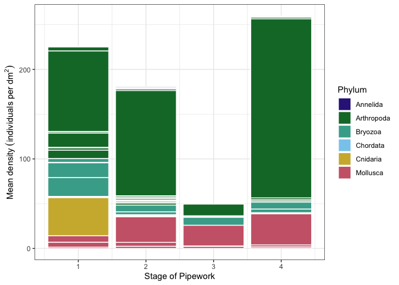
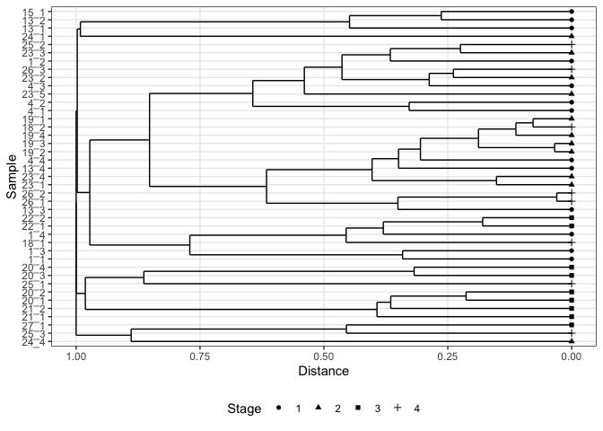
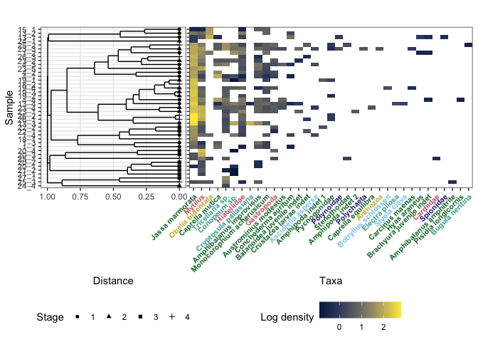

1-DataAnalysis
================
Arlie McCarthy
02/05/2021

# Code Setup and Data Import - because that is super-important

I have one data file with the count data from lab processing. The file
needs some wrangling to calculate a density (counts per decimeter
squared, aka 100cm2) for each quadrat sampled.

``` r
taxon_count_data <- read_delim((here::here("data", "taxon_count_data_internal_pipework.csv")), 
    delim = ",", escape_double = FALSE, trim_ws = TRUE)
```

    ## New names:
    ## Rows: 767 Columns: 19
    ## ── Column specification
    ## ──────────────────────────────────────────────────────── Delimiter: "," chr
    ## (6): sample_id, taxon, taxon_grouping_qualifier, description, sub_sampl... dbl
    ## (11): count, multiply_by, divide_by, quadrat_grids_number, quadrad_mesh_... lgl
    ## (2): density, ...19
    ## ℹ Use `spec()` to retrieve the full column specification for this data. ℹ
    ## Specify the column types or set `show_col_types = FALSE` to quiet this message.
    ## • `` -> `...19`

``` r
taxon_density <- taxon_count_data %>% 
  clean_names() %>% 
  mutate(id = paste(area, quadrat_number, sep = "_")) %>% #some quadrats had multiple 'sample' so changed to just area and quadrat
  filter(id != "23_6") %>% #an 'extras' sample was collected, but as a quadrat so removed from the community analysis
  mutate(count = case_when(taxon_grouping_qualifier == "colony" ~ count * 4,
                           taxon_grouping_qualifier == "fragment" ~ count * 0.25,
                           taxon_grouping_qualifier == "squares" ~ count * 4,
                           taxon_grouping_qualifier == "small colony" ~ count * 4,
                           taxon_grouping_qualifier == "large colony" ~ count * 8,
                           TRUE ~ count)) %>%  #converts colonial organisms to cm2, i.e. a count of 1 = 1cm2, density is then e.g. 1 cm2 per 1dm2
  mutate(taxon_verified = case_when(taxon == "mussel" ~ "mytilus", 
                                    taxon == "acorn barnacle" ~ "amphibalanus_improvisus",
                                    taxon == "barnacle type 2" ~ "amphibalanus_amphitrite",
                                    taxon == "clam" ~ "hiatellidae",
                                    taxon == "c.f. Jassa" ~ "jassa_marmorata", 
                                    taxon == "acorn barnacle ribbed" ~ "austrominius_modestus",
                                    taxon == "crab" ~ "carcinus_maenas",
                                    taxon == "encrusting bryozoan" ~ "conopeum",
                                    taxon == "white tufted bryozoan" | taxon == "type 2 white tufted bryozoan" ~ "tricellaria",
                                    taxon == "round amphipod" | taxon == "green eye amphipod" ~ "stenothoidae",
                                    taxon == "c.f. Conchoderma" ~ "conchoderma_auritum", 
                                    taxon == "brown bryozoan" ~ "bugula_neritina",
                                    taxon == "c.f. Corophium" ~ "monocorophium_acherusicum",
                                    taxon == "caprellid" ~ "caprella_mutica",
                                    taxon == "c.f. Schizoporella" ~ "cryptosula_pallasiana",
                                    taxon == "spiked encrusting bryo" ~ "electra_pilosa",
                                    taxon == "mystery tunicates? large anemone?" ~ "ascidiella_aspersa",
                                    taxon == "c.f. Caprella equilibra" ~ "caprella_equilibra",
                                    taxon == "anemone" ~ "anthozoa",
                                    taxon == "crab juvenile" ~ "Brachyura juvenile",
                                    taxon == "Hyas sp" ~ "hyas_araneus",
                                    taxon == "hydroid" ~ "hydroidolina",
                                    taxon == "tunicate" ~ "ascidiella_aspersa",
                                    taxon == "polychaete" ~ "polychaeta",
                                    taxon == "gastropod" ~ "gastropoda",
                                    taxon == "juvenile barnacle" ~ "Balanoidea juvenile",
                                    taxon == "mystery thing" ~ "styela_clava",
                                    taxon == "pycnogonid" ~ "pycnogonidae",
                                    taxon == "other bivalve" ~ "cardiidae",
                                    taxon == "squat lobster juvenile" ~ "Pisidia_longicornis",
                                    taxon == "red-eye amphipod" ~ "Amphipoda indet 1",
                                    taxon == "purple amphipod" ~ "Amphipoda indet 2",
                                    taxon == "clear_tunicates" ~ "ascidiella_aspersa",
                                    taxon == "colonial tunicate" ~ "botryllus_schlosseri",
                                    taxon == "crustacean larvae" ~ "Crustacea larvae indet",
                                    taxon == "Conopeum reticulum" ~ "conopeum",
                                    taxon == "Obelia bidentata" ~ "obelia_bidentata",
                                    taxon == "tricellaria_sp" ~ "tricellaria",
                                    TRUE ~ taxon
                                    ))  %>% 
  mutate(full_taxon_group = paste(taxon_verified, taxon_grouping_qualifier, sep = "_")) %>% 
  filter(full_taxon_group != "mytilus sp_valves intact, no tissue",
         full_taxon_group != "NA_NA",
         full_taxon_group != "mussel sp_valves intact",
         full_taxon_group != "insect_NA",
         full_taxon_group != "crab exoskeleton_NA",
         taxon_verified != "polychaete tube",
         taxon_verified != "sponge",
         taxon_verified != "nemertea")%>% 
  group_by(id, taxon_verified, taxon_grouping_qualifier, area, stage, quadrat_number) %>% 
  mutate(density = count*multiply_by/divide_by/area_sampled*100) %>% #counts per dm2
  summarise(avg_density = mean(density))
```

    ## `summarise()` has grouped output by 'id', 'taxon_verified',
    ## 'taxon_grouping_qualifier', 'area', 'stage'. You can override using the
    ## `.groups` argument.

``` r
site_info <- taxon_density %>% 
  ungroup() %>% 
  select(id, area, stage, quadrat_number) %>% 
  group_by(id) %>% 
  slice(1)
```

Check the species names and allocate higher taxonomic groups

``` r
taxa_list <- unique(taxon_density$taxon_verified) %>% 
  as_tibble() %>% 
  rename(taxon_name = value)
aphia_id <- wm_name2id_(name = taxa_list$taxon_name)
```

    ## Warning: (204) No Content - Brachyura juvenile

    ## Warning: (204) No Content - Balanoidea juvenile

    ## Warning: (204) No Content - Amphipoda indet 1

    ## Warning: (204) No Content - Crustacea larvae indet

    ## Warning: (204) No Content - Amphipoda indet 2

``` r
aphia_id_df <- aphia_id %>% 
  as_tibble() %>% 
  pivot_longer(cols = everything(),
               names_to = "taxon_name",
               values_to = "id") 
classification <- wm_classification_(aphia_id) %>% 
  pivot_wider(id_cols = id, names_from = c(rank), values_from = c(scientificname), values_fill = NA) %>%
  mutate(id = as.integer(id))
taxa_list_full <- aphia_id_df %>% 
  left_join(classification, by = "id") %>% 
  right_join(taxa_list, by = "taxon_name")
plotting_names <- taxon_density %>% 
  rename(taxon_name = taxon_verified) %>% 
  left_join(taxa_list_full %>% rename(aphia_id = id), by = "taxon_name") %>% 
  mutate(plotting_name = case_when(!is.na(Species) ~ Species,
                                   is.na(Species) ~ Genus,
                                   is.na(Genus) ~ Family,
                                   is.na(Family) ~ Order,
                                   is.na(Order) ~ Class,
                                   is.na(Class) ~ Subphylum,
                                   is.na(Subphylum) ~ Phylum)) %>% 
  mutate(plotting_name = case_when(is.na(plotting_name) ~ Family,
                                   TRUE ~ plotting_name)) %>% 
  mutate(plotting_name = case_when(is.na(plotting_name) ~ Order,
                                   TRUE ~ plotting_name)) %>%
  mutate(plotting_name = case_when(is.na(plotting_name) ~ Class,
                                   TRUE ~ plotting_name)) %>%
  mutate(plotting_name = case_when(is.na(plotting_name) ~ Subphylum,
                                   TRUE ~ plotting_name)) %>%
  mutate(plotting_name = case_when(is.na(plotting_name) ~ Phylum,
                                   TRUE ~ plotting_name)) %>% 
  mutate(plotting_name = case_when(taxon_name == "Amphipoda indet 1" ~ "Amphipoda indet 1",
                                   taxon_name == "Amphipoda indet 2" ~ "Amphipoda indet 2",
                                   taxon_name == "Tunicata indet 1" ~ "Tunicata indet 1",
                                   taxon_name == "Tunicata indet 2" ~ "Tunicata indet 2",
                                   taxon_name == "Tunicata indet 3" ~ "Tunicata indet 3",
                                   taxon_name == "Crustacea larvae indet" ~ "Crustacea larvae indet",
                                   taxon_name == "Brachyura juvenile" ~ "Brachyura juvenile indet",
                                   taxon_name == "Balanoidea juvenile" ~ "Balanoidea juvenile indet",
                                   taxon_name == "Anomura juvenile" ~ "Anomura juvenile indet",
                                   taxon_name == "conopeum" ~ "Conopeum sp.",
                                   taxon_name == "tricellaria" ~ "Tricellaria sp.",
                                   TRUE ~ plotting_name)) %>%
  mutate(Phylum = case_when(taxon_name == "Amphipoda indet 1" ~ "Arthropoda",
                            taxon_name == "Amphipoda indet 2" ~ "Arthropoda",
                            taxon_name == "Tunicata indet 1" ~ "Chordata",
                            taxon_name == "Tunicata indet 2" ~ "Chordata",
                            taxon_name == "Tunicata indet 3" ~ "Chordata",
                            taxon_name == "Crustacea larvae indet" ~ "Arthropoda",
                            taxon_name == "Brachyura juvenile" ~ "Arthropoda",
                            taxon_name == "Balanoidea juvenile" ~ "Arthropoda",
                            taxon_name == "Anomura juvenile" ~ "Arthropoda",
                            TRUE ~ Phylum)) %>% 
  select(taxon_name, plotting_name, Phylum, stage, avg_density)
```

    ## Adding missing grouping variables: `id`, `taxon_grouping_qualifier`, `area`

# Preparing Data for ordination

I take my data from counts to a community matrix, with species as
variables and rows as samples

``` r
community_matrix_rough <- plotting_names %>% 
  group_by(id, plotting_name) %>% 
  summarise(avg_density = sum(avg_density)) %>% 
  pivot_wider(names_from = plotting_name, values_from = avg_density, values_fill = 0) %>% 
  ungroup()
```

    ## `summarise()` has grouped output by 'id'. You can override using the `.groups`
    ## argument.

``` r
#community_matrix_rough[is.na(community_matrix_rough)] <- 0
community_matrix <- community_matrix_rough %>% 
  column_to_rownames(var = "id") %>% 
  filter_all(any_vars(. != 0))
write_csv(community_matrix %>% 
  rownames_to_column(var = "id"), here("data","community_matrix.csv"), col_names = TRUE)
write_csv(site_info, here("data","site_info.csv"), col_names = TRUE)
```

## nMDS

``` r
internal_pipe_nmds <- metaMDS(community_matrix, distance = "bray", k = 2, trymax = 500)
```

    ## Square root transformation
    ## Wisconsin double standardization
    ## Run 0 stress 0.2052366 
    ## Run 1 stress 0.1949497 
    ## ... New best solution
    ## ... Procrustes: rmse 0.1346327  max resid 0.3645798 
    ## Run 2 stress 0.2072936 
    ## Run 3 stress 0.2209578 
    ## Run 4 stress 0.19495 
    ## ... Procrustes: rmse 0.0006747345  max resid 0.002587224 
    ## ... Similar to previous best
    ## Run 5 stress 0.1931093 
    ## ... New best solution
    ## ... Procrustes: rmse 0.1176037  max resid 0.2986012 
    ## Run 6 stress 0.2055807 
    ## Run 7 stress 0.1930807 
    ## ... New best solution
    ## ... Procrustes: rmse 0.004007448  max resid 0.01395228 
    ## Run 8 stress 0.1930793 
    ## ... New best solution
    ## ... Procrustes: rmse 0.001223381  max resid 0.006295099 
    ## ... Similar to previous best
    ## Run 9 stress 0.2129636 
    ## Run 10 stress 0.205581 
    ## Run 11 stress 0.1934914 
    ## ... Procrustes: rmse 0.01567  max resid 0.07514131 
    ## Run 12 stress 0.1932328 
    ## ... Procrustes: rmse 0.1186825  max resid 0.2874057 
    ## Run 13 stress 0.1935315 
    ## ... Procrustes: rmse 0.01606437  max resid 0.07583131 
    ## Run 14 stress 0.2093223 
    ## Run 15 stress 0.2129629 
    ## Run 16 stress 0.2052368 
    ## Run 17 stress 0.1932326 
    ## ... Procrustes: rmse 0.1183983  max resid 0.2873341 
    ## Run 18 stress 0.2161249 
    ## Run 19 stress 0.2034655 
    ## Run 20 stress 0.1934908 
    ## ... Procrustes: rmse 0.01491939  max resid 0.07270998 
    ## *** Best solution repeated 1 times

``` r
internal_pipe_nmds
```

    ## 
    ## Call:
    ## metaMDS(comm = community_matrix, distance = "bray", k = 2, trymax = 500) 
    ## 
    ## global Multidimensional Scaling using monoMDS
    ## 
    ## Data:     wisconsin(sqrt(community_matrix)) 
    ## Distance: bray 
    ## 
    ## Dimensions: 2 
    ## Stress:     0.1930793 
    ## Stress type 1, weak ties
    ## Best solution was repeated 1 time in 20 tries
    ## The best solution was from try 8 (random start)
    ## Scaling: centring, PC rotation, halfchange scaling 
    ## Species: expanded scores based on 'wisconsin(sqrt(community_matrix))'

``` r
data_scores <- as_tibble(scores(internal_pipe_nmds, display = c("sites")))  #Using the scores function from vegan to extract the site scores and convert to a data.frame
data_scores$site <- rownames(scores(internal_pipe_nmds, display = c("sites")))  # create a column of site names, from the rownames of data.scores
data_scores <- data_scores %>% 
  mutate("id" = site) %>% 
  left_join(site_info)
```

    ## Joining with `by = join_by(id)`

``` r
data_scores$n_species <- specnumber(community_matrix, MARGIN = 1)
data_scores$shannon <- diversity(community_matrix, index = "shannon")
data_scores$simpson <- diversity(community_matrix, index = "simpson")
species_scores <- as_tibble(scores(internal_pipe_nmds, "species"))  #Using the scores function from vegan to extract the species scores and convert to a data.frame
species_scores$species <- rownames(species_scores)
```

Plotting with ggplot

``` r
nmds_plot <- ggplot() + 
  #geom_text(data=species_scores,aes(x=NMDS1,y=NMDS2,label=species),alpha=0.5) +  # add the species labels
  #geom_point(data=data_scores,aes(x=NMDS1,y=NMDS2,shape=as_factor(stage), colour= as_factor(area)),size=3) + # add the point markers
  geom_point(data=data_scores,aes(x=NMDS1,y=NMDS2,shape = as_factor(stage), colour = n_species),size=3) + # add the point markers
  #geom_text(data=data_scores,aes(x=NMDS1,y=NMDS2,label=area),size=6,vjust=0) +  # add the site labels
  coord_equal() +
  theme_bw() +
  scale_colour_viridis_c("Number of taxa") +
  scale_shape("Stage of Pipework", labels = c("1 - sea chest", "2 - sea strainer", "3 - mid ships", "4 - overboard discharge"))
nmds_plot
```

<!-- -->

``` r
save_plot(here("outputs", "nmds_plot.png"), nmds_plot, base_width = 183, base_height = 100, units = "mm")
```

Checking the nMDS

``` r
goodness(internal_pipe_nmds) # Produces a results of test statistics for goodness of fit for each point
```

    ##  [1] 0.04763037 0.03267889 0.02622873 0.01971368 0.03069701 0.03405638
    ##  [7] 0.03406080 0.02575069 0.01915956 0.03387549 0.02049790 0.02163501
    ## [13] 0.02695590 0.03807817 0.02360163 0.02297276 0.03246520 0.02278386
    ## [19] 0.04762263 0.02855167 0.05823443 0.02200856 0.02558861 0.01552055
    ## [25] 0.02047896 0.02860381 0.02050833 0.02086943 0.03405638 0.03596618
    ## [31] 0.04545201 0.02172076 0.05068499 0.01842201 0.01708923 0.01961678
    ## [37] 0.03596618 0.02171096 0.02286656 0.01870938 0.02327131

``` r
stressplot(internal_pipe_nmds) # Produces a Shepards diagram
```

<!-- -->

# Density of different groups

Here I will make a stacked bar chart to show mean density of different
taxonomic groups at each stage of the pipework

``` r
#average density for each taxon in each area
mean_density_area <- plotting_names %>% 
  group_by(id, plotting_name, area, stage, Phylum) %>% 
  summarise(avg_density = sum(avg_density)) %>% #this ensures that there is only one number per taxon per sample
  ungroup() %>% 
  filter(!is.na(avg_density))  %>% 
  group_by(plotting_name, area, stage, Phylum) %>% 
  summarise(avg_density = mean(avg_density))
```

    ## `summarise()` has grouped output by 'id', 'plotting_name', 'area', 'stage'. You
    ## can override using the `.groups` argument.
    ## `summarise()` has grouped output by 'plotting_name', 'area', 'stage'. You can
    ## override using the `.groups` argument.

``` r
area_info <- site_info %>% 
  ungroup() %>% 
  select(area, stage) %>% 
  group_by(area,stage) %>% 
  slice(1)

mean_density_area_wider <- mean_density_area %>% 
  pivot_wider(names_from = c(area),
              names_sep = "_",
              values_from = avg_density,
              values_fill = 0)

mean_density_area_longer <- mean_density_area_wider %>% 
  pivot_longer(cols = 4:17,
               names_to = "area",
               values_to = "avg_density")

mean_density_area_full <- mean_density_area_longer %>% 
  mutate(area = as.numeric(area)) %>% 
  right_join(area_info, by = c("area", "stage"))

mean_density_stage <- mean_density_area_full %>% 
  group_by(plotting_name, stage, Phylum) %>% 
  summarise(avg_density = mean(avg_density))
```

    ## `summarise()` has grouped output by 'plotting_name', 'stage'. You can override
    ## using the `.groups` argument.

Now to plot it. This plot will be aligned with a schematic diagram
representing the pipework system, so that readers can visualise passage
through the pipes and the changes in taxa over space. Ultimately, this
will have to be grouped/coloured by more manageable chunks than all the
taxa I have listed. But even without that, it’s clear that the Jassa
amphipods dominate right the way through. It’s also clear that there
isn’t a great deal surviving in the pipework areas sampled in the middle
of the ship, but they do survive transit and settle and grow in the
final stage before overboard discharge.

``` r
pal <- c("#332288", "#117733", "#44AA99", "#88CCEE", "#CEB53A", "#CC6677", "#AA4499", "#882255")
stacked_bar_plot <- ggplot() +
  geom_bar(data = mean_density_stage,
           aes(x = stage, y = avg_density, fill = Phylum),
           colour = "white",
           stat = "identity",
           position = "stack") +
#  geom_line(data = mean_density_stage, #problem with line is that without 0 for stages where taxa are absent, it connects the line making it look like the density goes consistently up/down rather than sharp changes
#           aes(x = stage, y = avg_density, colour = taxon),
#           stat = "identity",
#           position = "stack") +
  labs(x = "Stage of Pipework") +
  ylab(expression(Mean~density~(individuals~per~dm^2))) +
  theme_bw() +
  scale_fill_manual("Phylum", values = pal)
  #scale_fill_viridis_d(option = "B", direction = 1, begin = 0.1)
stacked_bar_plot
```

<!-- -->

``` r
save_plot(here("outputs", "stacked_bar_plot.png"), stacked_bar_plot, base_width = 183, base_height = 100, units = "mm")
```

# Taxonomic richness in each stage, and overall metrics to be used in the table.

``` r
#species richness by phylum per area
mean_richness_area <- mean_density_area_full %>% 
  group_by(stage, area, Phylum) %>% 
  filter(avg_density > 0) %>% 
  summarise(richness = n_distinct(plotting_name)) %>% 
  pivot_wider(names_from = c(area),
              names_sep = "_",
              values_from = richness,
              values_fill = 0) %>% 
  pivot_longer(cols = 3:16,
               names_to = "area",
               values_to = "richness") %>% 
  mutate(area = as.numeric(area)) %>% 
  right_join(area_info, by = c("area", "stage"))
```

    ## `summarise()` has grouped output by 'stage', 'area'. You can override using the
    ## `.groups` argument.

``` r
#the mean taxonomic richness and SE per phylum per stage
mean_richness_stage <- mean_richness_area %>% 
  group_by(Phylum, stage) %>% 
  summarise(mean_richness = mean(richness),
            sd_richness = sd(richness, na.rm = TRUE),
            se_richness = std.error(richness, na.rm = TRUE))
```

    ## `summarise()` has grouped output by 'Phylum'. You can override using the
    ## `.groups` argument.

``` r
#species richness by phylum for all stages, i.e. overall richness across all stages by phylum
mean_density_area_full %>% 
  group_by(Phylum) %>% 
  filter(avg_density > 0) %>% 
  summarise(count = n_distinct(plotting_name))
```

    ## # A tibble: 6 × 2
    ##   Phylum     count
    ##   <chr>      <int>
    ## 1 Annelida       3
    ## 2 Arthropoda    18
    ## 3 Bryozoa        5
    ## 4 Chordata       3
    ## 5 Cnidaria       2
    ## 6 Mollusca       4

``` r
#species richness by stage for all phyla, i.e. overall richness for each stage
mean_density_area_full %>% 
  group_by(stage) %>% 
  filter(avg_density > 0) %>% 
  summarise(count = n_distinct(plotting_name))
```

    ## # A tibble: 4 × 2
    ##   stage count
    ##   <dbl> <int>
    ## 1     1    22
    ## 2     2    21
    ## 3     3     9
    ## 4     4    16

``` r
#total density per stage
mean_density_area_full %>% 
  group_by(area, stage) %>% 
  summarise(total_density = sum(avg_density)) %>% #gives the total density of all taxa in each area
  group_by(stage) %>% 
  summarise(avg_total_density = mean(total_density),
            se_density = std.error(total_density)) #gives the mean total density across areas for each stage
```

    ## `summarise()` has grouped output by 'area'. You can override using the
    ## `.groups` argument.

    ## # A tibble: 4 × 3
    ##   stage avg_total_density se_density
    ##   <dbl>             <dbl>      <dbl>
    ## 1     1             226.        92.0
    ## 2     2             181.        89.5
    ## 3     3              49.5       20.1
    ## 4     4             260.       147.

``` r
#Overall mean richness per stage (i.e. each area within a stage had, on average x taxa)
mean_density_area_full %>% 
  group_by(stage, area) %>% 
  filter(avg_density > 0) %>% 
  summarise(richness = n_distinct(plotting_name)) %>% 
  pivot_wider(names_from = c(area),
              names_sep = "_",
              values_from = richness,
              values_fill = 0) %>% 
  pivot_longer(cols = 2:15,
               names_to = "area",
               values_to = "richness") %>% 
  mutate(area = as.numeric(area)) %>% 
  right_join(area_info, by = c("area", "stage")) %>% 
  summarise(mean_richness = mean(richness),
            se_richness = std.error(richness, na.rm = TRUE))
```

    ## `summarise()` has grouped output by 'stage'. You can override using the
    ## `.groups` argument.

    ## # A tibble: 4 × 3
    ##   stage mean_richness se_richness
    ##   <dbl>         <dbl>       <dbl>
    ## 1     1            13        2.89
    ## 2     2            11        4.93
    ## 3     3             4        1.29
    ## 4     4             8        4.36

# Creating a heatmap with dendrograms

``` r
species_names <- colnames(community_matrix)
# Obtain the dendrogram
dend <- as.dendrogram(hclust(vegdist(community_matrix, method = "bray")))
dend_data <- dendro_data(dend)
```

#### Setup the data, so that the layout is inverted (this is more “clear” than simply using coord_flip())

``` r
segment_data <- with(
  segment(dend_data), 
  data.frame(x = y, y = x, xend = yend, yend = xend))
# Extract dendrogram terminal segment data
dendrogram_ends <- with(segment(dend_data) %>%
  filter(yend == 0),
  data.frame(x = y, y = x, xend = yend, yend = xend))
```

Use the dendrogram label data to position the sample labels

``` r
sample_pos_table <- with(
  dend_data$labels, 
  data.frame(y_center = x, id = as.character(label), height = 1)) %>% 
  left_join(site_info, by = "id")
# bind the sample information to the dendrogram ends for plotting
dendrogram_ends <- bind_cols(dendrogram_ends, sample_pos_table)
```

Creating custom colours for the labels of stages

``` r
axiscolour <- c("#999999", "#E69F00", "#56B4E9", "#009E73", "#F0E442", "#0072B2", "#D55E00", "#CC79A7")
  #brewer_pal(type = "seq", palette = "Dark2")(6)

sample_pos_table <- sample_pos_table %>% 
  mutate(labs_colour = case_when(stage == 1 ~ axiscolour[8],
                                 stage == 2 ~ axiscolour[2],
                                 stage == 3 ~ axiscolour[3],
                                 stage == 4 ~ axiscolour[4]))
dend_palette <- axiscolour[c(8, 2, 3, 4)]
```

Table to position the samples

I also prepare suitable names for plotting the taxa and colouring by
phylum (using the same colour scheme as the stacked bar chart)

``` r
species_pos_table <- data.frame("taxon" = species_names) %>%
  left_join(plotting_names %>% 
              group_by(plotting_name, Phylum) %>% 
              mutate(density = sum(avg_density, na.rm = TRUE)) %>% 
              select(plotting_name, Phylum, density) %>% 
              slice(1) %>% 
              arrange(desc(density)) %>% 
              rename(taxon = plotting_name), 
            by = "taxon") %>% 
  arrange(desc(density)) %>% 
  dplyr::mutate(x_center = (1:n()), 
         width = 1) %>%
  mutate(labs_colour = case_when(Phylum == "Annelida" ~ pal[1],
                                 Phylum == "Arthropoda" ~ pal[2],
                                 Phylum == "Bryozoa" ~ pal[3],
                                 Phylum == "Chordata" ~ pal[4],
                                 Phylum == "Cnidaria" ~ pal[5],
                                 Phylum == "Mollusca" ~ pal[6],
                                 Phylum == "Nemertea" ~ pal[7],
                                 Phylum == "Porifera" ~ pal[8])) %>% 
  select(-density)
# Neglecting the gap parameters
heatmap_data <- community_matrix %>% 
  mutate("id" = rownames(community_matrix)) %>% 
  pivot_longer(cols = !id, names_to = "taxon", values_to = "density")%>%
  left_join(sample_pos_table) %>%
  left_join(species_pos_table, by = "taxon")
```

    ## Joining with `by = join_by(id)`

``` r
# changing 0 to NA so that samples/samples with low density appear different to those with none.
heatmap_data[heatmap_data == 0] <- NA

# Limits for the vertical axes
sample_axis_limits <- with(
  sample_pos_table, 
  c(min(y_center - 0.5 * height), max(y_center + 0.5 * height))
) + 
  0.1 * c(-1, 1) # extra spacing: 0.1
```

\#For the heatmap plot I have changed the ‘fill’ to log density rather
than density, as I think that \#with raw densities only Jassa was
anything other than blue really - this way gives a bit more idea of the
\#variation. Easy to go back though if you don’t like it!

``` r
# Heatmap plot
plt_hmap <- ggplot(heatmap_data, 
                   aes(x = x_center, y = y_center, fill = log10(density), 
                       height = height, width = width)) + 
  geom_tile() +
  scale_fill_viridis_c("Log density", option = "cividis", na.value = "white", begin = 0) +
  scale_x_continuous(breaks = species_pos_table$x_center, 
                     labels = species_pos_table$taxon,
                     expand = c(0, 0)
                     ) + 
  # For the y axis, alternatively set the labels as: sample_position_table$gene
  scale_y_continuous(breaks = sample_pos_table[, "y_center"], 
                     labels = rep("", nrow(sample_pos_table)),
                     limits = sample_axis_limits,
                     expand = c(0, 0)
                     ) + 
  labs(x = "Taxa", y = "") +
  theme_bw() +
  theme(axis.text.x = element_text(color=species_pos_table$labs_colour, size = rel(0.9), face = "bold", hjust = 1, angle = 45), 
        # margin: top, right, bottom, and left
        plot.margin = unit(c(1, 0.2, 0.2, -0.7), "cm"), 
        panel.grid.minor = element_blank(),
        legend.position = "bottom",
        legend.direction = "horizontal")
```

    ## Warning: Vectorized input to `element_text()` is not officially supported.
    ## ℹ Results may be unexpected or may change in future versions of ggplot2.

``` r
plt_hmap
```

<!-- -->

``` r
# Dendrogram plot
plt_dendr <- ggplot(segment_data) + 
  geom_segment(aes(x = x, y = y, xend = xend, yend = yend)) + 
  geom_point(data = dendrogram_ends, aes(x= xend, y = yend, shape = as_factor(sample_pos_table$stage))) +
  scale_x_reverse() + 
  scale_y_continuous(breaks = sample_pos_table$y_center, 
                     labels = sample_pos_table$id, 
                     limits = sample_axis_limits, 
                     expand = c(0, 0)) + 
  labs(x = "Distance", y = "Sample", size = "") +
  scale_shape("Stage") +
  theme_bw() + 
  theme(panel.grid.minor = element_blank()) +
  theme(#axis.text.y = element_text(face = "bold"),
        legend.position = "bottom",
        legend.direction = "horizontal")
plt_dendr
```

<!-- -->

Plot them both together and save

``` r
heat_dend_plot <- plot_grid(plt_dendr, plt_hmap, align = 'h', rel_widths = c(1, 1.5))
heat_dend_plot
```

<!-- -->

``` r
save_plot(here("outputs", "heat_dend_plot.png"), heat_dend_plot, base_width = 183, base_height = 140, units = "mm")
```

# Pulling out key numbers

Highest densities

``` r
max(plotting_names$avg_density, na.rm = TRUE)
```

    ## [1] 478.04

``` r
plotting_names %>% 
  group_by(id, plotting_name, area, stage) %>% 
  summarise(avg_density = sum(avg_density)) %>%
  arrange(desc(avg_density)) %>%
  head()
```

    ## `summarise()` has grouped output by 'id', 'plotting_name', 'area'. You can
    ## override using the `.groups` argument.

    ## # A tibble: 6 × 5
    ## # Groups:   id, plotting_name, area [6]
    ##   id    plotting_name    area stage avg_density
    ##   <chr> <chr>           <dbl> <dbl>       <dbl>
    ## 1 26_2  Jassa marmorata    26     4        611.
    ## 2 26_1  Jassa marmorata    26     4        610.
    ## 3 13_3  Jassa marmorata    13     1        478.
    ## 4 13_4  Jassa marmorata    13     1        318.
    ## 5 19_3  Jassa marmorata    19     2        256.
    ## 6 19_2  Jassa marmorata    19     2        244.

``` r
#Density per taxon from each sample in stage 4
plotting_names %>% 
  group_by(id, plotting_name, area, stage) %>% 
  summarise(avg_density = sum(avg_density)) %>%
  arrange(desc(avg_density)) %>%
  filter(stage == 4)
```

    ## `summarise()` has grouped output by 'id', 'plotting_name', 'area'. You can
    ## override using the `.groups` argument.

    ## # A tibble: 45 × 5
    ## # Groups:   id, plotting_name, area [45]
    ##    id    plotting_name    area stage avg_density
    ##    <chr> <chr>           <dbl> <dbl>       <dbl>
    ##  1 26_2  Jassa marmorata    26     4       611. 
    ##  2 26_1  Jassa marmorata    26     4       610. 
    ##  3 18_2  Jassa marmorata    18     4       204. 
    ##  4 26_2  Mytilus            26     4       142. 
    ##  5 26_3  Jassa marmorata    26     4       132. 
    ##  6 26_1  Mytilus            26     4       103. 
    ##  7 25_2  Jassa marmorata    25     4        88.9
    ##  8 25_2  Tricellaria sp.    25     4        37.3
    ##  9 18_1  Jassa marmorata    18     4        31.2
    ## 10 26_3  Mytilus            26     4        28.5
    ## # ℹ 35 more rows
